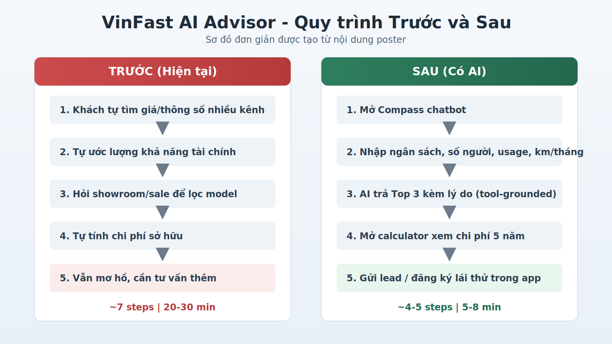
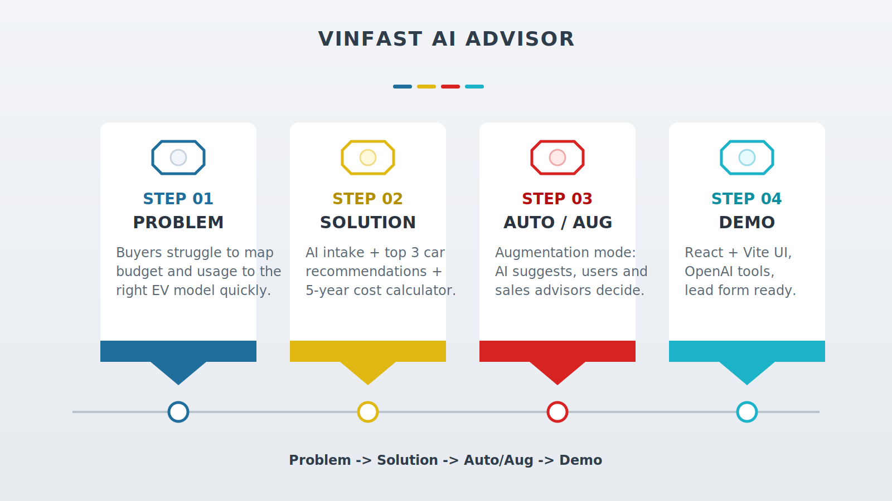

# VinFast AI Advisor (Compass)

Prototype chatbot tu van mua xe VinFast voi quy trinh:
- Thu intake nhu cau (ngan sach, so nguoi, usage, km/thang, uu tien)
- Goi y Top 3 xe phu hop
- Tinh chi phi so huu (tra gop + chi phi sac + tong 5 nam)
- Ho tro gui lead / dang ky lai thu

## Tech stack

- Frontend: React + Vite
- AI: OpenAI Chat Completions + tool calling
- Backend (optional): FastAPI (Python)
- Data: JSON vehicle catalog

## Chay local

### Frontend

```bash
cd Hackathon/Demo
npm install
npm run dev
```

### Backend tools (optional)

```bash
cd server
pip install -r requirements.txt
# run FastAPI app on your configured port
```

## Poster va hinh anh

### 1) Main project poster


### 2) Before/After flow diagram



### 3) 4-step infographic poster



### 4) Poster content in Markdown

- [poster-vinmec-triage-showcase.md](poster-vinmec-triage-showcase.md)

## Tai lieu lien quan

- [spec-final.md](spec-final.md)
- [prototype.md](prototype.md)
- [Hackathon/Demo/README.md](Hackathon/Demo/README.md)

## Muc tieu demo

- Giam thoi gian pre-consult cho nguoi mua xe
- Tang do ro rang trong quyet dinh mua xe
- Tang conversion cho lead / test drive
